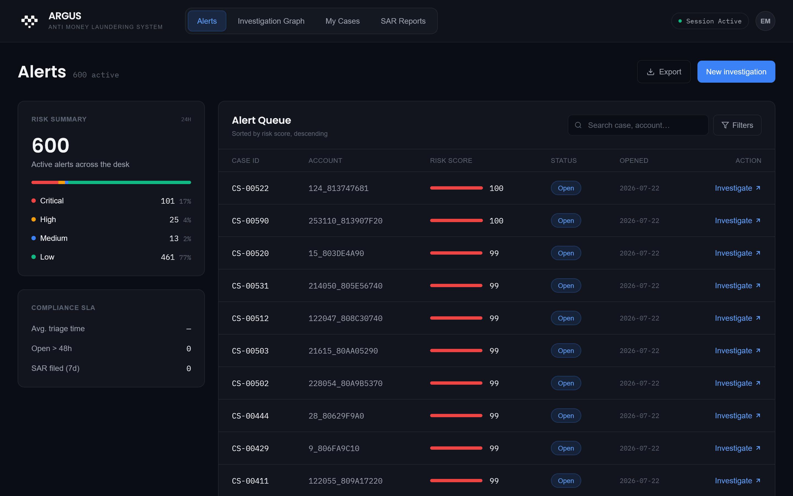
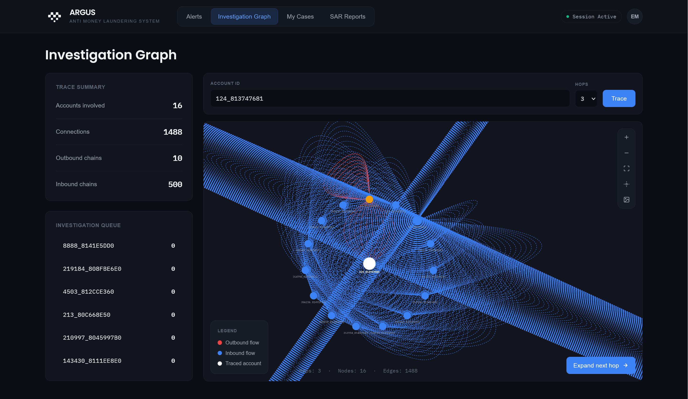
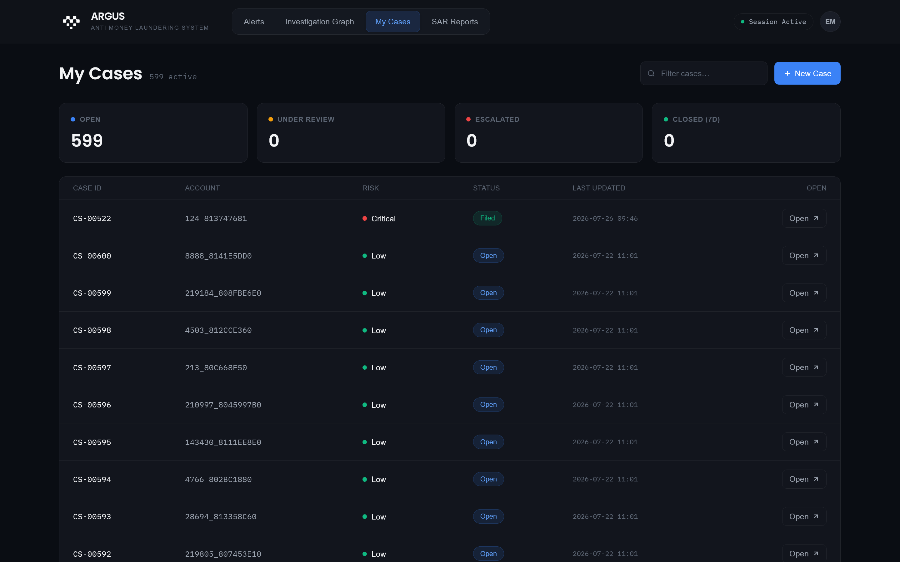
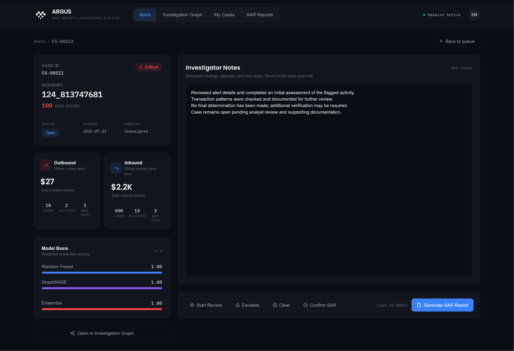
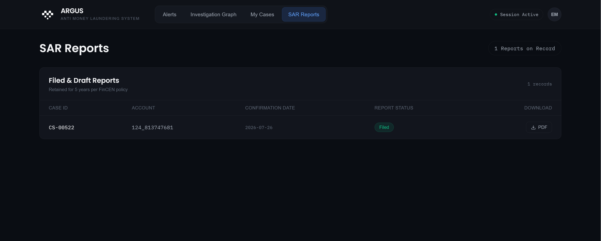
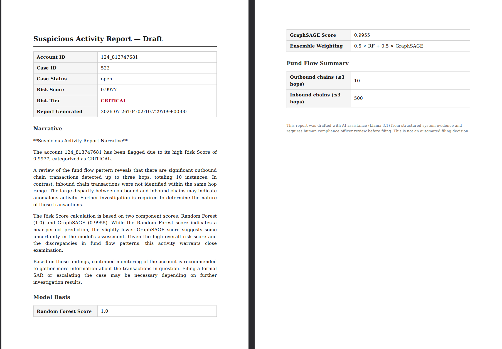

# ARGUS – Anti Money Laundering System

ARGUS is a Anti Money Laundering (AML) investigation platform that helps analysts identify suspicious financial transactions, investigate money flow, and generate Suspicious Activity Reports (SARs).

The system combines Machine Learning and Graph Neural Networks (GraphSAGE) with graph-based transaction analysis to detect potentially fraudulent accounts.

## Features

- Detect suspicious accounts using AI models
- Visualize money flow using an interactive investigation graph
- Investigate inbound and outbound transaction chains
- Manage AML investigation cases
- Generate AI-assisted Suspicious Activity Reports (SAR)
- Export SAR reports as PDF

## Tech Stack

---
# Architecture

# Application(Screenshots/argus_aml_architecture.png)

## 1. Alerts Dashboard

## 2. Investigation Graph

## 3. My Cases

## 4. Investigation Notes

## 5. SAR Reports

## 6. Generated SAR Report

---

